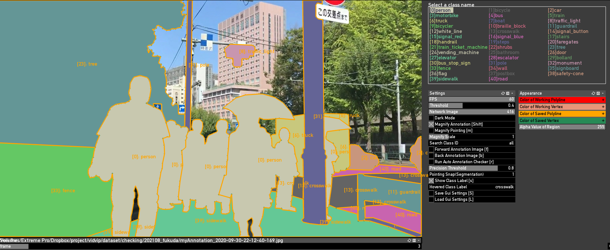

# Applications

## VIDVIP-anno(macOS)

VIDVIPデータセットをアノテーションするために開発した独自のアプリケーションです。うちわの需要のみに基づいて開発したので癖が強いですが、効率良いアノテーション作業を実現しています。

  * [VIDVIP-anno](./VIDVIP-anno.dmg)

## VIDVIP-Cap (iOS)
上記アノテーションソフトウェアのモバイル版として位置づけていましたが，結果としては主にデータ収集が目的のアプリケーションです．鈴木さんが開発してくれています．

### about page

<h2>プロジェクトの概要</h2>
このプロジェクトは視覚障害を持つユーザの屋外移動支援を目的としてスタートしました。盲導犬や介助者が同行するように、身の回りの障害物をリアルタイムに検出することで、単独移動時でも安全な支援を目指しています。それらの実現に向け，自動運転のようなコンピュータビジョンの為のデータセットが必要と考え，本プロジェクトでは歩道上の移動に特化した物体検出データセットの開発をはじめました．例えば点字ブロックや横断歩道、歩行者用信号の色等を本データセットを活用した深層学習モデルで高精度に認識することができます。

本プロジェクトを詳しく知りたい場合は <a href="https://tetsuakibaba.jp/project/vidvip/">VIDVIP公式ウェブサイト（ブラウザが開きます）</a>をご参照ください。

<h2>このアプリについて</h2>
このアプリは日本全国各地において、障害を持つ当事者の通学路や通勤経路を収集し、歩行支援のためのアノテーションを行い、開発したデータセットを公開することを目的として開発しました。投稿されたデータはクラウド上のサーバに送信され、VIDVIP Projecではその画像をアノテーションし、データセットの拡充に用います。送信したデータの取り扱いに関しては <a href="#プライバシーポリシー">プライバシーポリシー</a>を参照してください。

<h2>プロジェクト代表者</h2>

本プロジェクトに関するお問い合わせは研究統括の馬場（東京都立大学）までメールをお送りください。

<ul>
<li>馬場 哲晃, 東京都立大学</li>
<li>https://tetsuakibaba.jp</li>
<li>baba@tmu.ac.jp</li>
</ul>

<h2>連携・協力</h2>
<h3>Project WHEE</h3>

車椅子における安全装備と自律走行に応用しています。

<h3>釜江 常好（東京大学／スタンフォード大学名誉教授）</h3>

本研究プロジェクトスタート当初から開発及びコーディネータとして協力を得ています．

<h3>東京大学大学院渡邉英徳研究室</h3>

実証実験や応用手法の検討に関して協力を得ています

<h3>九州大学麻生典研究室</h3>

データセット、学習モデルに関する知的財産やライセンスについて協力を得ています

<h3>株式会社コンピュータサイエンス研究所</h3>

VIDVIPデータセットの学習モデルを活用したナビゲーション開発を行っています

<h3>鈴木孝宏</h3>

iOSのソフトウェアデベロッパーとして協力を得ています

### プライバシーポリシー
<h2>Policies & Guidelines</h2>

Date of Last Revision: 2021-05-27

VIDVIP Projectは，本ウェブサイト上で提供するサービス（以下,「本サービス」といいます。）における，ユーザーの個人情報の取扱いについて，以下のとおりプライバシーポリシー（以下，「本ポリシー」といいます。）を定めます。

<h2>第1条（個人情報）</h2>

「個人情報」とは，個人情報保護法にいう「個人情報」を指すものとし，生存する個人に関する情報であって，当該情報に含まれる氏名，生年月日，住所，電話番号，連絡先その他の記述等により特定の個人を識別できる情報及び容貌，指紋，声紋にかかるデータ，及び健康保険証の保険者番号などの当該情報単体から特定の個人を識別できる情報（個人識別情報）を指します。また、VIDVIP ProjectではVIDVIP-Capアプリ（以下、「本アプリ」）を利用してアップロードされたデータ（撮影画像及び、メタデータ）をこの「個人情報」に含めて以下詳細を定めます。

<h2>第2条（個人情報の収集方法）</h2>

本アプリを利用することで、ユーザが本アプリを利用して撮影したjpg画像、ユーザが本アプリを利用して撮影したタイムスタンプ（日付、時間）、撮影時のGPS座標（緯度および経度）と制度情報（vertical accuracy および horizontal accuracy）、撮影時のスマートフォンのクオータニオン情報（Yaw, Pitch, Roll）及び地磁気センサ情報を収集します。

<h2>第3条（個人情報を収集・利用する目的）</h2>
VIDVIP Projectが個人情報を収集・利用する目的は，以下のとおりです。
<ol>
<li>ユーザーからのお問い合わせに回答するため（本人確認を行うことを含む）</li>
<li>不正・不当な目的でサービスを利用しようとするユーザーの特定をし，ご利用をお断りするため</li>
<li>上記の利用目的に付随する目的</li>
</ol>

<h2>第4条（利用目的の変更）</h2>

利用目的が変更前と関連性を有すると合理的に認められる場合に限り，個人情報の利用目的を変更するものとします。利用目的の変更を行った場合には，変更後の目的について本ウェブサイト上に公表するものとします。

<h2>第5条（個人情報の第三者提供）</h2>

次に掲げる場合を除いて，あらかじめユーザーの同意を得ることなく，第三者に個人情報を提供することはありません。ただし，個人情報保護法その他の法令で認められる場合を除きます。

<ol>
<li>
VIDVIP Project運営側が肖像権及び個人情報保護の観点から問題がないと判断した画像を深層学習用オープンデータセットとして公開すること。
</li>
<li>
人の生命，身体または財産の保護のために必要がある場合であって，本人の同意を得ることが困難であるとき。
</li>
<li>
公衆衛生の向上または児童の健全な育成の推進のために特に必要がある場合であって，本人の同意を得ることが困難であるとき。
</li>
<li>
国の機関もしくは地方公共団体またはその委託を受けた者が法令の定める事務を遂行することに対して協力する必要がある場合であって，本人の同意を得ることにより当該事務の遂行に支障を及ぼすおそれがあるとき。
</li>
</ol>

前項の定めにかかわらず，次に掲げる場合には，当該情報の提供先は第三者に該当しないものとします。

<ol>
<li>当プロジェクトが利用目的の達成に必要な範囲内において個人情報の取扱いの全部または一部を委託する場合</li>
<li>プロジェクトの承継に伴って個人情報が提供される場合</li>
</ol>

<h2>第6条（個人情報の開示）</h2>

本人から個人情報の開示を求められたときは，本人に対し，遅滞なくこれを開示します。ただし，当アプリからアップロードされた画像及びメタデータからのみで開示者の個人特定が困難である場合、開示できないことがあります。緊急性を要する場合等は可能な範囲で個別対応をする場合があります。

<h2>第7条（個人情報の削除）</h2>

本アプリを利用してユーザから提供された画像及びメタデータに関し、以下の項目に該当する場合は運営側が対象ユーザへの事前通知無しにデータの削除を行います。データ削除後も該当ユーザへの通知はありません。

<ol>
<li>公序良俗に反する画像及びメタデータ</li>
<li>VIDVIP Projectの趣旨とは異なる画像およびメタデータ</li>
</ol>

<h2>第8条（プライバシーポリシーの変更）</h2>
<ol>
<li>本ポリシーの内容は，法令その他本ポリシーに別段の定めのある事項を除いて，ユーザーに通知することなく，変更することができるものとします。</li>
<li>当社が別途定める場合を除いて，変更後のプライバシーポリシーは，本ウェブサイトに掲載したときから効力を生じるものとします。</li>
</ol>

