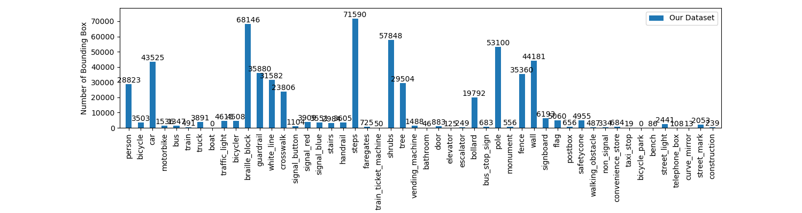
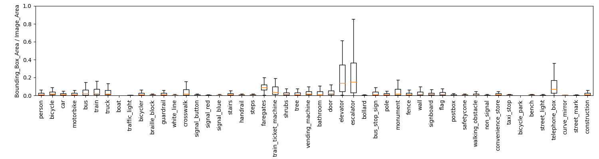

# VIDVIP
VIDVIPは歩道移動時のための日本国内特化型障害物等物体検出データセット開発と学習済みモデルを提供するプロジェクトです．

 * [Project Website](https://tetsuakibaba.jp/project/vidvip/)
 * [データセットREADME](./dataset/README.md)
 * [データセット操作script](https://github.com/TetsuakiBaba/VIDVIP/tree/main/dataset/script)
 * [アプリケーション](./Applications/README.md)

## 最新データセット状況

 ## darknetでの学習
 ./dataset 上に、metaファイルを手動作成後、[createTrainValidationTest.py](./dataset/script/createTrainValidationTest.py) を利用してtest.txt, train.txt, validation.txtを生成する。cfgファイルは [./dataset/cfg](./dataset/cfg)に一覧があります。
 
 学習に利用するコマンドテンプレは以下。
 
   * darknet detector train meta.txt cfg/yolo.cfg -map -gpus 0,1,2,3
     * -map ：mAPを4エポックごとに計算して、グラフ上に描画する。これやっとかないと止めどころがわからないので、必須オプション
     * -gpus：利用するGPUのどれを使うかを明示する。お部屋が涼しいならありったけ使おう。

学習後のmap算出
  * darknet detector map meta.txt cfg/yolo.cfg yolo.weights

### Reference
  * 学習方法の詳細については https://github.com/AlexeyAB を参照する

 ## CreateMLでの学習
 以下の通り。
   1. coremlフォルダにすべてのjpg, txtファイルをコピー
   2. cd script
   3. python3 [yolo2json.py](./dataset/script/yolo2json.py) -s ../coreml
   4. CreateML から学習フォルダに coreml フォルダを指定して学習を開始する（学習にはM1 chip、2TBストレージ構成を推奨）。IntelでeGPUでもそこそこ速度でますが謎のabort()トラブルが生じるので現状利用していません。object detectionはシステムフォルダに死ぬほどcheckpointを作成するので、12時間位学習させただけで1TBを超えてきます。これはCreateMLの改良を待ちます。

