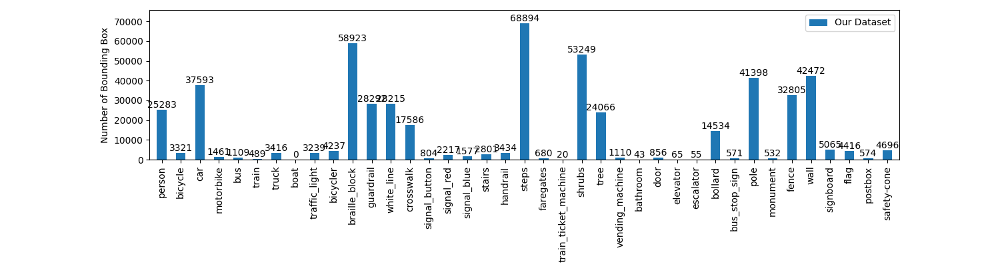
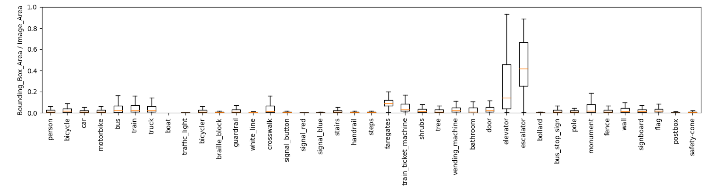

# VIDVIP
VIDVIP(VIsual Dataset for Visually Impaired Persons）は歩道移動時のための日本国内特化型障害物等物体検出データセット開発と学習済みモデルを提供するプロジェクトです．

現在（2023年5月2日）VIDVIPデータセットには VIDVIP Object Detection（VIDVIPo）とVIDVIP Segmentation（VIDVIPs）の2種類が存在します。

 * [Project Website](https://tetsuakibaba.jp/project/vidvip/)
 * [データセットREADME](./dataset/README.md)
 * [データセット操作script](https://github.com/TetsuakiBaba/VIDVIP/tree/main/dataset/script)
 * [アプリケーション](./Applications/README.md)

## 最新データセット状況

# vidvipo
 ## darknetでの学習
 ./dataset 上に、metaファイルを手動作成後、[createTrainValidationTest.py](./dataset/script/createTrainValidationTest.py) を利用してtest.txt, train.txt, validation.txtを生成する。cfgファイルは [./dataset/cfg](./dataset/cfg)に一覧があります。
 
 学習に利用するコマンドテンプレは以下。
 
   * darknet detector train meta.txt cfg/yolo.cfg -map -gpus 0,1,2,3
     * -map ：mAPを4エポックごとに計算して、グラフ上に描画する。これやっとかないと止めどころがわからないので、必須オプション
     * -gpus：利用するGPUのどれを使うかを明示する。お部屋が涼しいならありったけ使おう。

学習後のmap算出
  * darknet detector map meta.txt cfg/yolo.cfg yolo.weights

### Reference
  * 学習方法の詳細については https://github.com/AlexeyAB を参照する

 ## CreateMLでの学習
 以下の通り。
   1. coremlフォルダにすべてのjpg, txtファイルをコピー
   2. cd script
   3. python3 [yolo2json.py](./dataset/script/yolo2json.py) -s ../coreml
   4. CreateML から学習フォルダに coreml フォルダを指定して学習を開始する（学習にはM1 chip、2TBストレージ構成を推奨）。IntelでeGPUでもそこそこ速度でますが謎のabort()トラブルが生じるので現状利用していません。object detectionはシステムフォルダに死ぬほどcheckpointを作成するので、12時間位学習させただけで1TBを超えてきます。これはCreateMLの改良を待ちます。
  
# vidvips
Segmentationは deeplabv3を利用して、生成したpbファイルをcoreml形式に変換する手順です。deeplabv3の学習は https://qiita.com/mucchyo/items/d21993abee5e6e44efad を参照してください。ただしvidvipsの学習時には以下の点に注意します。
  * learning_rateは0.07にする（転移学習なしなので、大きめにしておく）
  * 基準となる学習ステップは100,000 steps（認識結果確認済）
  * total_lossは100,000stepで、0.7程度になりました。（もっといけるかもしれない）
  * 転移学習はしない
  * その他のパラメータはpascal vocと同じにしておく
  * 画像ファイルは小さくしておく（目安はwidth:600px、アスペクト比は固定）
  * cropサイズも上記に合わせて 600x338にしておく

